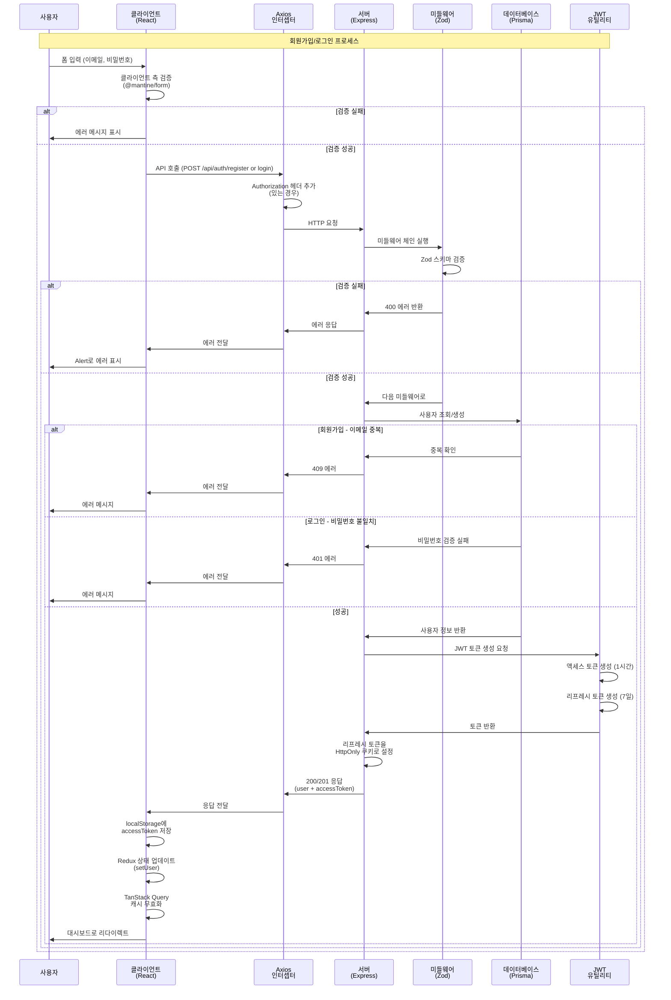
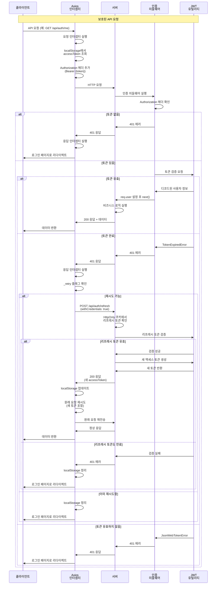
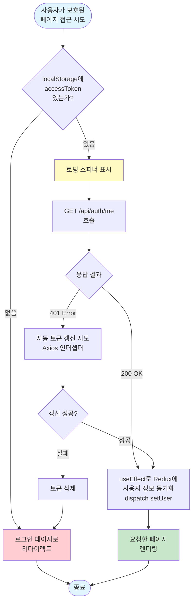
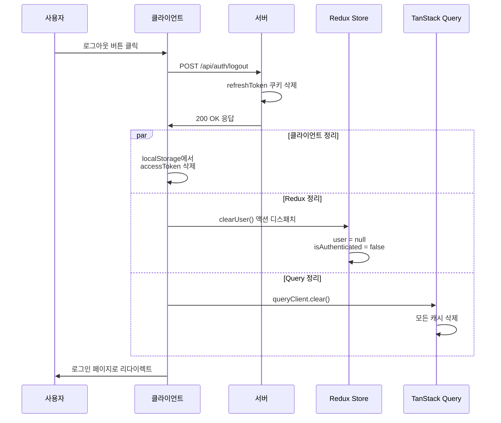
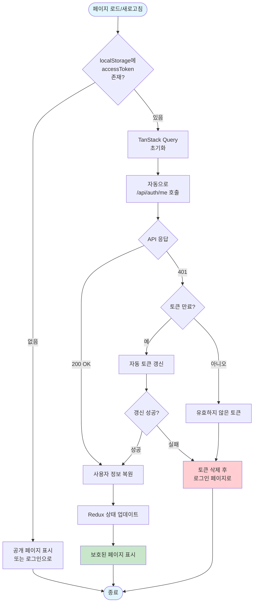

# 인증 플로우 (Authentication Flow)

## 개요

WorkLife Dashboard는 JWT(JSON Web Token) 기반의 인증 시스템을 사용합니다. 이 문서는 전체 인증 플로우와 각 단계에서의 동작을 설명합니다.

---

## 전체 인증 플로우 다이어그램

### 회원가입/로그인 플로우



### 인증된 API 요청 플로우



### 보호된 라우트 접근 플로우



### 로그아웃 플로우



### 페이지 새로고침 시 세션 복원



---

## 1. 회원가입 플로우

### 프론트엔드 (Client)

**1. 사용자 입력**
- 위치: `client/src/pages/SignupPage.tsx`
- 입력 필드:
  - 이름 (최소 2자)
  - 이메일 (유효한 이메일 형식)
  - 비밀번호 (최소 8자, 대소문자, 숫자 포함)
  - 비밀번호 확인
  - 약관 동의

**2. 실시간 검증**
```typescript
// @mantine/form을 사용한 클라이언트 측 검증
validate: {
  email: (value) => !/^\S+@\S+$/.test(value) ? '올바른 이메일 형식이 아닙니다' : null,
  password: (value) => {
    if (value.length < 8) return '비밀번호는 최소 8자 이상이어야 합니다'
    if (!/[A-Z]/.test(value)) return '대문자를 하나 이상 포함해야 합니다'
    // ... 추가 검증
  }
}
```

**3. 비밀번호 강도 표시**
- Progress 바로 강도 시각화 (약함/보통/강함)
- Popover로 요구사항 체크리스트 표시
- 실시간 업데이트

**4. API 호출**
```typescript
// client/src/hooks/useAuth.ts
const register = async (data: RegisterData) => {
  return registerMutation.mutateAsync(data);
}
```

### 백엔드 (Server)

**5. 요청 수신 및 검증**
```
POST /api/auth/register
```

- 위치: `server/src/routes/authRoutes.ts`
- 미들웨어 체인:
  1. `validate(registerSchema)` - Zod 스키마 검증
  2. `authController.register` - 컨트롤러 실행

**6. Zod 스키마 검증**
```typescript
// server/src/validators/authValidator.ts
export const registerSchema = z.object({
  body: z.object({
    email: z.string().email('올바른 이메일 형식이 아닙니다'),
    password: z.string()
      .min(8, '비밀번호는 최소 8자 이상이어야 합니다')
      .regex(/[A-Z]/, '대문자를 하나 이상 포함해야 합니다')
      .regex(/[a-z]/, '소문자를 하나 이상 포함해야 합니다')
      .regex(/[0-9]/, '숫자를 하나 이상 포함해야 합니다'),
    name: z.string().min(1, '이름을 입력해주세요'),
  }),
});
```

**7. 이메일 중복 확인**
```typescript
// server/src/controllers/authController.ts
const emailExists = await isEmailTaken(email);
if (emailExists) {
  res.status(409).json({
    success: false,
    message: '이미 사용 중인 이메일입니다',
  });
  return;
}
```

**8. 비밀번호 해싱**
```typescript
// server/src/utils/password.ts
import bcrypt from 'bcrypt';

export const hashPassword = async (password: string): Promise<string> => {
  const saltRounds = 10;
  return bcrypt.hash(password, saltRounds);
};
```

**9. 사용자 생성**
```typescript
// server/src/services/userService.ts
const user = await prisma.user.create({
  data: {
    email: data.email,
    password: hashedPassword,
    name: data.name,
  },
  select: {
    id: true,
    email: true,
    name: true,
    createdAt: true,
    updatedAt: true,
  },
});
```

**10. JWT 토큰 생성**
```typescript
// server/src/utils/jwt.ts
const accessToken = generateAccessToken({
  userId: user.id,
  email: user.email,
});

const refreshToken = generateRefreshToken({
  userId: user.id,
  email: user.email,
});
```

**11. 쿠키 설정**
```typescript
// 리프레시 토큰을 HttpOnly 쿠키로 설정
res.cookie('refreshToken', refreshToken, {
  httpOnly: true,
  secure: process.env.NODE_ENV === 'production',
  sameSite: 'strict',
  maxAge: 7 * 24 * 60 * 60 * 1000, // 7일
});
```

**12. 응답 전송**
```typescript
res.status(201).json({
  success: true,
  message: '회원가입이 완료되었습니다',
  data: {
    user,
    accessToken,
  },
});
```

### 프론트엔드 (Client) - 응답 처리

**13. 토큰 저장**
```typescript
// client/src/hooks/useAuth.ts
onSuccess: (data) => {
  localStorage.setItem('accessToken', data.accessToken);
  dispatch(setUser(data.user));
  queryClient.invalidateQueries({ queryKey: ['auth'] });
  navigate('/dashboard');
}
```

**14. Redux 상태 업데이트**
```typescript
// client/src/store/slices/authSlice.ts
setUser: (state, action: PayloadAction<User>) => {
  state.user = action.payload;
  state.isAuthenticated = true;
}
```

**15. 대시보드로 리다이렉트**
- React Router의 `navigate('/dashboard')` 실행
- 자동으로 인증된 사용자로 대시보드 접근

---

## 2. 로그인 플로우

### 프론트엔드 (Client)

**1. 사용자 입력**
- 위치: `client/src/pages/LoginPage.tsx`
- 입력 필드:
  - 이메일
  - 비밀번호
  - 로그인 상태 유지 (선택)

**2. API 호출**
```typescript
const login = async (credentials: LoginCredentials) => {
  return loginMutation.mutateAsync(credentials);
}
```

### 백엔드 (Server)

**3. 요청 수신**
```
POST /api/auth/login
```

**4. 사용자 조회**
```typescript
const user = await findUserByEmail(email);
if (!user) {
  res.status(401).json({
    success: false,
    message: '이메일 또는 비밀번호가 올바르지 않습니다',
  });
  return;
}
```

**5. 비밀번호 검증**
```typescript
const isPasswordValid = await verifyPassword(password, user.password);
if (!isPasswordValid) {
  res.status(401).json({
    success: false,
    message: '이메일 또는 비밀번호가 올바르지 않습니다',
  });
  return;
}
```

**6. JWT 토큰 생성 및 응답**
- 회원가입과 동일한 방식으로 토큰 생성
- 액세스 토큰은 JSON 응답에 포함
- 리프레시 토큰은 HttpOnly 쿠키로 설정

### 프론트엔드 (Client) - 응답 처리

**7. 토큰 저장 및 상태 업데이트**
- localStorage에 액세스 토큰 저장
- Redux 상태 업데이트
- 대시보드로 리다이렉트

---

## 3. 인증된 요청 플로우

### Axios 인터셉터 동작

**1. 요청 인터셉터**
```typescript
// client/src/lib/axios.ts
api.interceptors.request.use(
  (config) => {
    const token = localStorage.getItem('accessToken');
    if (token && config.headers) {
      config.headers.Authorization = `Bearer ${token}`;
    }
    return config;
  }
);
```

**2. 백엔드에서 토큰 검증**
```typescript
// server/src/middlewares/auth.ts
export const authenticateToken = (req, res, next) => {
  const authHeader = req.headers['authorization'];
  const token = authHeader && authHeader.split(' ')[1];

  if (!token) {
    return res.status(401).json({
      success: false,
      message: '인증 토큰이 필요합니다',
    });
  }

  const decoded = verifyAccessToken(token);
  req.user = decoded;
  next();
};
```

**3. 토큰 만료 시 자동 갱신**
```typescript
// client/src/lib/axios.ts
api.interceptors.response.use(
  (response) => response,
  async (error) => {
    if (error.response?.status === 401 && !originalRequest._retry) {
      originalRequest._retry = true;

      try {
        // 리프레시 토큰으로 새 액세스 토큰 요청
        const response = await axios.post('/api/auth/refresh', {}, {
          withCredentials: true
        });

        const { accessToken } = response.data;
        localStorage.setItem('accessToken', accessToken);

        // 원래 요청 재시도
        originalRequest.headers.Authorization = `Bearer ${accessToken}`;
        return api(originalRequest);
      } catch (refreshError) {
        // 리프레시 토큰도 만료된 경우 로그아웃
        localStorage.removeItem('accessToken');
        window.location.href = '/login';
        return Promise.reject(refreshError);
      }
    }
    return Promise.reject(error);
  }
);
```

---

## 4. 로그아웃 플로우

**1. 클라이언트에서 로그아웃 요청**
```typescript
const logout = async () => {
  return logoutMutation.mutateAsync();
}
```

**2. 백엔드 처리**
```
POST /api/auth/logout
```
- 리프레시 토큰 쿠키 삭제
- 응답 전송

**3. 클라이언트 정리**
```typescript
onSuccess: () => {
  localStorage.removeItem('accessToken');
  dispatch(clearUser());
  queryClient.clear();
  navigate('/login');
}
```

---

## 5. 보호된 라우트 접근

### PrivateRoute 컴포넌트

```typescript
// client/src/components/auth/PrivateRoute.tsx
export function PrivateRoute({ children }: PrivateRouteProps) {
  const { isAuthenticated, isLoading } = useAuth();

  // 로딩 중
  if (isLoading) {
    return <Center><Loader size="lg" /></Center>;
  }

  // 인증되지 않은 경우
  if (!isAuthenticated) {
    return <Navigate to="/login" replace />;
  }

  // 인증된 경우
  return <>{children}</>;
}
```

### 동작 흐름

1. **토큰 확인**
   - localStorage에서 accessToken 조회
   - 토큰이 있으면 `/api/auth/me` 호출

2. **사용자 정보 조회**
   ```typescript
   const { data: currentUser, isLoading } = useQuery({
     queryKey: ['auth', 'me'],
     queryFn: authApi.me,
     enabled: !!localStorage.getItem('accessToken'),
     retry: false,
     staleTime: Infinity,
   });
   ```

3. **TanStack Query → Redux 동기화**
   ```typescript
   // useAuth.ts에서 자동 동기화
   useEffect(() => {
     if (currentUser) {
       dispatch(setUser(currentUser));
     }
   }, [currentUser, dispatch]);
   ```
   - TanStack Query가 `/api/auth/me`에서 사용자 정보를 가져오면
   - useEffect가 자동으로 Redux 스토어에 동기화
   - 이를 통해 페이지 새로고침 후에도 인증 상태 복원

4. **다중 소스 인증 확인**
   ```typescript
   const effectiveUser = user || currentUser || null;
   const effectiveIsAuthenticated = Boolean(
     effectiveUser || localStorage.getItem("accessToken")
   );
   ```
   - Redux user (useEffect로 동기화된 후)
   - TanStack Query currentUser (API 호출 중)
   - localStorage token (즉시 확인 가능)
   - 세 가지 소스 중 하나라도 있으면 인증된 것으로 간주

5. **상태에 따른 처리**
   - `isLoading=true`: 로딩 스피너 표시
   - `isAuthenticated=false`: 로그인 페이지로 리다이렉트
   - `isAuthenticated=true`: 요청한 페이지 렌더링

---

## 6. 세션 지속성

### 페이지 새로고침 시

1. **App 로드**
   - localStorage에서 accessToken 확인
   - 토큰이 있으면 자동으로 `/api/auth/me` 호출

2. **사용자 정보 복원**

   ```typescript
   // TanStack Query가 localStorage에 토큰이 있으면 자동으로 /api/auth/me 호출
   const { data: currentUser, isLoading } = useQuery({
     queryKey: ['auth', 'me'],
     queryFn: authApi.me,
     enabled: !!localStorage.getItem('accessToken'),
     retry: false,
     staleTime: Infinity,
   });
   ```

3. **useEffect로 Redux에 자동 동기화**

   ```typescript
   // useAuth.ts
   useEffect(() => {
     if (currentUser) {
       dispatch(setUser(currentUser));
     }
   }, [currentUser, dispatch]);
   ```

   - API에서 사용자 정보를 받아오면 자동으로 Redux에 동기화
   - 페이지 새로고침 후에도 인증 상태가 복원됨
   - Redux와 TanStack Query가 항상 일관된 상태 유지

4. **다중 소스 폴백 체인**

   ```typescript
   const effectiveUser = user || currentUser || null;
   const effectiveIsAuthenticated = Boolean(
     effectiveUser || localStorage.getItem("accessToken")
   );

   return {
     user: effectiveUser,
     isAuthenticated: effectiveIsAuthenticated,
     isLoading,
   };
   ```

   - 인증 확인 우선순위: Redux user → TanStack Query user → localStorage token
   - 이를 통해 로딩 중에도 즉시 인증 상태 확인 가능

---

## 플로우 다이어그램

```
회원가입/로그인
    ↓
클라이언트: 폼 입력 및 검증
    ↓
클라이언트: API 요청
    ↓
서버: Zod 검증
    ↓
서버: 비즈니스 로직 (사용자 생성/조회)
    ↓
서버: JWT 토큰 생성
    ↓
서버: 응답 (액세스 토큰 + 리프레시 토큰 쿠키)
    ↓
클라이언트: 토큰 저장 (localStorage)
    ↓
클라이언트: Redux 상태 업데이트
    ↓
클라이언트: 대시보드로 리다이렉트
    ↓
이후 모든 요청에 자동으로 토큰 첨부 (Axios 인터셉터)
    ↓
토큰 만료 시 자동 갱신 (리프레시 토큰 사용)
```

---

## 에러 처리

### 클라이언트 측 에러

1. **폼 검증 에러**
   - @mantine/form이 실시간으로 표시
   - 입력 필드 하단에 빨간색 메시지

2. **API 에러**
   - `Alert` 컴포넌트로 상단에 표시
   - 백엔드에서 받은 에러 메시지 표시

### 서버 측 에러

1. **검증 에러 (400)**
   ```json
   {
     "success": false,
     "message": "입력 데이터가 올바르지 않습니다",
     "errors": [
       {
         "path": "body.email",
         "message": "올바른 이메일 형식이 아닙니다"
       }
     ]
   }
   ```

2. **인증 에러 (401)**
   ```json
   {
     "success": false,
     "message": "이메일 또는 비밀번호가 올바르지 않습니다"
   }
   ```

3. **중복 에러 (409)**
   ```json
   {
     "success": false,
     "message": "이미 사용 중인 이메일입니다"
   }
   ```

---

## 관련 파일

### 프론트엔드
- `client/src/pages/LoginPage.tsx` - 로그인 페이지
- `client/src/pages/SignupPage.tsx` - 회원가입 페이지
- `client/src/hooks/useAuth.ts` - 인증 훅
- `client/src/lib/axios.ts` - Axios 설정 및 인터셉터
- `client/src/services/api/authApi.ts` - 인증 API 함수
- `client/src/store/slices/authSlice.ts` - Redux Auth Slice
- `client/src/components/auth/PrivateRoute.tsx` - 보호된 라우트

### 백엔드
- `server/src/routes/authRoutes.ts` - 인증 라우트
- `server/src/controllers/authController.ts` - 인증 컨트롤러
- `server/src/services/userService.ts` - 사용자 서비스
- `server/src/middlewares/auth.ts` - 인증 미들웨어
- `server/src/middlewares/validate.ts` - 검증 미들웨어
- `server/src/validators/authValidator.ts` - Zod 스키마
- `server/src/utils/jwt.ts` - JWT 유틸리티
- `server/src/utils/password.ts` - 비밀번호 유틸리티
