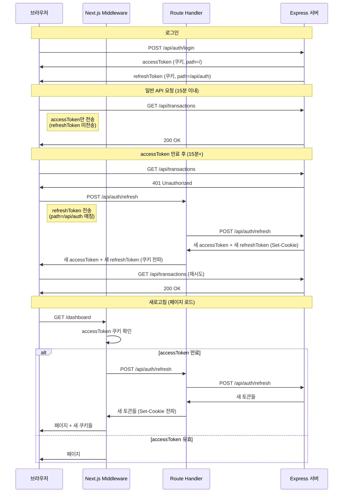

# 인증 토큰 보안 개선 계획

## 1. 현재 문제점 분석

### 1.1 토큰 갱신 실패 문제

**증상**: 로그인 후 30분 정도 지나서 새로고침하면 로그인 페이지로 리다이렉트됨

**근본 원인**: RefreshToken Rotation 후 쿠키 전파 실패

```
현재 흐름:
1. 로그인 → refreshToken_A 발급
2. 15분 후 accessToken 만료 → refresh 호출
3. 서버: refreshToken_A revoke, refreshToken_B 발급 (Set-Cookie)
4. ❌ 브라우저 쿠키에는 여전히 refreshToken_A 저장 (전파 실패)
5. 다시 15분 후 새로고침
6. middleware가 refreshToken_A로 갱신 시도
7. 서버: "REVOKED" → 모든 세션 무효화 → 로그인 페이지로 리다이렉트
```

**문제 코드 위치**:
- `client/middleware.ts`: Route Handler 응답의 Set-Cookie를 브라우저로 전달하지 않음
- `client/src/app/api/auth/refresh/route.ts`: 서버의 refreshToken Set-Cookie를 클라이언트로 전파하지 않음

### 1.2 토큰 분리의 의미 희석

**현재 구조**:
```
AccessToken:  httpOnly=false, path=/  → 모든 요청에 전송, JS 접근 가능
RefreshToken: httpOnly=true, path=/   → 모든 요청에 전송
```

**문제점**:
- RefreshToken이 모든 요청에 전송됨 (갱신 요청에만 전송되어야 함)
- AccessToken이 httpOnly=false라서 XSS 공격에 노출 가능
- 원래 의도한 "자주 쓰는 토큰은 짧게, 가끔 쓰는 토큰은 길게" 원칙이 무력화

---

## 2. 개선 목표

### 2.1 Cookie Path 분리

```
개선된 구조:
AccessToken:  httpOnly=true, path=/         → 모든 API에 전송, JS 접근 불가
RefreshToken: httpOnly=true, path=/api/auth → 갱신 요청에만 전송
```

**효과**:
- RefreshToken 노출 최소화 (갱신 엔드포인트에서만 전송)
- AccessToken XSS 방어 (httpOnly)
- 원래 토큰 분리 의도 복원

### 2.2 토큰 갱신 흐름 정상화

- Middleware와 Route Handler에서 refreshToken 쿠키 전파
- Rotation 유지하면서 안정적인 토큰 갱신

---

## 3. 구현 방안

### Phase 1: 서버 수정 (하위 호환 유지)

#### 1-1. auth middleware 수정
**파일**: `server/src/middlewares/auth.ts`

```typescript
// 변경 전: Authorization 헤더만 확인
const authHeader = req.headers['authorization'];
const token = authHeader && authHeader.split(' ')[1];

// 변경 후: Authorization 헤더 우선, 없으면 쿠키에서 읽기
const authHeader = req.headers['authorization'];
let token = authHeader && authHeader.split(' ')[1];

if (!token) {
  token = req.cookies?.accessToken;
}
```

**이유**: 클라이언트가 httpOnly 쿠키를 사용하더라도 기존 헤더 방식도 계속 지원

#### 1-2. refreshToken 쿠키 path 변경
**파일**: `server/src/controllers/authController.ts`

```typescript
// 변경 전
const refreshTokenCookieOptions: CookieOptions = {
  httpOnly: true,
  secure: isProduction,
  sameSite: isProduction ? 'none' : 'lax',
  maxAge: refreshTokenMaxAgeMs,
  domain: process.env.COOKIE_DOMAIN || undefined,
};

// 변경 후
const refreshTokenCookieOptions: CookieOptions = {
  httpOnly: true,
  secure: isProduction,
  sameSite: isProduction ? 'none' : 'lax',
  maxAge: refreshTokenMaxAgeMs,
  domain: process.env.COOKIE_DOMAIN || undefined,
  path: '/api/auth',  // 추가: 갱신 엔드포인트에서만 전송
};
```

---

### Phase 2: 클라이언트 수정

#### 2-1. accessToken 쿠키 설정 변경
**파일**: `client/src/lib/constants/auth.ts`

```typescript
// 변경 전
export const getAccessTokenCookieOptions = (maxAge = DEFAULT_ACCESS_TOKEN_MAX_AGE) => ({
  name: ACCESS_TOKEN_COOKIE_NAME,
  httpOnly: false,  // JS 접근 가능
  secure: process.env.NODE_ENV === "production",
  sameSite: "lax" as const,
  path: "/",
  maxAge,
  ...(ACCESS_TOKEN_COOKIE_DOMAIN ? { domain: ACCESS_TOKEN_COOKIE_DOMAIN } : {}),
});

// 변경 후
export const getAccessTokenCookieOptions = (maxAge = DEFAULT_ACCESS_TOKEN_MAX_AGE) => ({
  name: ACCESS_TOKEN_COOKIE_NAME,
  httpOnly: true,   // XSS 방어
  secure: process.env.NODE_ENV === "production",
  sameSite: "lax" as const,
  path: "/",
  maxAge,
  ...(ACCESS_TOKEN_COOKIE_DOMAIN ? { domain: ACCESS_TOKEN_COOKIE_DOMAIN } : {}),
});
```

#### 2-2. axios 인터셉터 수정
**파일**: `client/src/lib/axios.ts`

```typescript
// 변경 전: Authorization 헤더 설정
api.interceptors.request.use(
  (config: InternalAxiosRequestConfig) => {
    startProgress();
    const token = getClientAccessToken();  // JS에서 쿠키 읽기
    if (token && config.headers) {
      config.headers.Authorization = `Bearer ${token}`;
    }
    return config;
  },
  ...
);

// 변경 후: 쿠키 자동 전송 (withCredentials: true로 충분)
api.interceptors.request.use(
  (config: InternalAxiosRequestConfig) => {
    startProgress();
    // httpOnly 쿠키는 withCredentials: true로 자동 전송됨
    // Authorization 헤더 설정 불필요
    return config;
  },
  ...
);
```

#### 2-3. session.ts 수정
**파일**: `client/src/lib/session.ts`

```typescript
// getClientAccessToken 함수 제거 또는 deprecated 처리
// httpOnly 쿠키는 JavaScript에서 읽을 수 없음

// 변경 전
export const getClientAccessToken = (): string | null => {
  if (typeof document === "undefined") {
    return null;
  }
  const match = document.cookie.match(/(?:^|; )accessToken=([^;]+)/);
  return match ? decodeURIComponent(match[1]) : null;
};

// 변경 후: 함수 제거 또는 항상 null 반환
// 인증 상태 확인은 서버에서 /api/auth/me 호출로 대체
```

#### 2-4. Route Handler 수정 (핵심)
**파일**: `client/src/app/api/auth/refresh/route.ts`

```typescript
// 변경 후: 서버 응답의 refreshToken 쿠키를 클라이언트로 전파
export async function POST(request: NextRequest) {
  const cookieHeader = request.headers.get("cookie") ?? "";
  const origin = request.headers.get("origin") ?? request.nextUrl.origin;

  try {
    const apiResponse = await fetch(`${API_BASE_URL}/api/auth/refresh`, {
      method: "POST",
      headers: {
        cookie: cookieHeader,
        origin,
      },
      credentials: "include",
    });

    if (!apiResponse.ok) {
      return createErrorResponse(apiResponse.status, "Failed to refresh access token");
    }

    const payload = await apiResponse.json();
    const accessToken = payload?.data?.accessToken ?? payload?.accessToken;

    if (!accessToken) {
      return createErrorResponse(500, "Access token missing in response");
    }

    const response = NextResponse.json({ success: true, accessToken });

    // accessToken 쿠키 설정
    response.cookies.set({
      ...getAccessTokenCookieOptions(DEFAULT_ACCESS_TOKEN_MAX_AGE),
      value: accessToken,
    });

    // 서버 응답의 Set-Cookie에서 refreshToken 추출하여 전파
    const setCookieHeader = apiResponse.headers.get("set-cookie");
    if (setCookieHeader) {
      const refreshTokenMatch = setCookieHeader.match(/refreshToken=([^;]+)/);
      if (refreshTokenMatch) {
        response.cookies.set({
          name: "refreshToken",
          value: refreshTokenMatch[1],
          httpOnly: true,
          secure: process.env.NODE_ENV === "production",
          sameSite: "lax",
          path: "/api/auth",
          maxAge: 7 * 24 * 60 * 60, // 7일
        });
      }
    }

    return response;
  } catch (error) {
    return createErrorResponse(500, (error as Error).message);
  }
}
```

#### 2-5. Middleware 수정 (핵심)
**파일**: `client/middleware.ts`

```typescript
// 토큰 갱신 후 refreshToken 쿠키도 브라우저로 전달
if (refreshToken) {
  try {
    const refreshUrl = new URL("/api/auth/refresh", request.url);
    const refreshResponse = await fetch(refreshUrl, {
      method: "POST",
      headers: {
        cookie: request.headers.get("cookie") ?? "",
        origin: request.nextUrl.origin,
      },
    });

    if (refreshResponse.ok) {
      const payload = await refreshResponse.json();
      const newAccessToken = payload?.accessToken ?? payload?.data?.accessToken;

      if (newAccessToken) {
        const response = NextResponse.next();

        // accessToken 쿠키 설정
        response.cookies.set({
          ...getAccessTokenCookieOptions(DEFAULT_ACCESS_TOKEN_MAX_AGE),
          value: newAccessToken,
        });

        // refreshToken 쿠키 전파
        const setCookieHeader = refreshResponse.headers.get("set-cookie");
        if (setCookieHeader) {
          // Set-Cookie 헤더에서 refreshToken 파싱하여 전달
          const cookies = setCookieHeader.split(", ");
          for (const cookie of cookies) {
            if (cookie.startsWith("refreshToken=")) {
              const match = cookie.match(/refreshToken=([^;]+)/);
              if (match) {
                response.cookies.set({
                  name: "refreshToken",
                  value: match[1],
                  httpOnly: true,
                  secure: process.env.NODE_ENV === "production",
                  sameSite: "lax",
                  path: "/api/auth",
                  maxAge: 7 * 24 * 60 * 60,
                });
              }
            }
          }
        }

        return response;
      }
    }
  } catch (error) {
    console.error("Failed to refresh access token in middleware", error);
  }
}
```

---

## 4. 수정 파일 목록

| 파일 | 변경 내용 | 우선순위 |
|------|----------|---------|
| `server/src/middlewares/auth.ts` | 쿠키에서 accessToken 읽기 지원 | 1 |
| `server/src/controllers/authController.ts` | refreshToken 쿠키 path=/api/auth | 1 |
| `client/src/lib/constants/auth.ts` | accessToken httpOnly=true | 2 |
| `client/src/lib/axios.ts` | Authorization 헤더 설정 제거 | 2 |
| `client/src/lib/session.ts` | getClientAccessToken 제거/수정 | 2 |
| `client/src/app/api/auth/refresh/route.ts` | refreshToken 쿠키 전파 | 2 |
| `client/middleware.ts` | refreshToken 쿠키 전파 | 2 |
| `client/src/hooks/useAuth.ts` | 토큰 관련 로직 검토 | 3 |
| `client/src/store/useAuthStore.ts` | 인증 상태 확인 로직 검토 | 3 |

---

## 5. 테스트 시나리오

### 5.1 기본 기능 테스트
- [ ] 일반 로그인 → 대시보드 접근
- [ ] Google 로그인 → 대시보드 접근
- [ ] 로그아웃 → 쿠키 삭제 확인
- [ ] 로그아웃 후 보호된 페이지 접근 차단

### 5.2 토큰 갱신 테스트
- [ ] 15분 후 API 호출 → 토큰 자동 갱신 확인
- [ ] 30분+ 후 새로고침 → 로그인 유지 확인
- [ ] 여러 탭에서 동시 사용 → 토큰 충돌 없음

### 5.3 SSR 테스트
- [ ] SSR 페이지 직접 접근 → 인증 상태 유지
- [ ] 새로고침 → 페이지 정상 로드
- [ ] 딥링크 접근 → 인증 상태 유지

### 5.4 보안 테스트
- [ ] document.cookie로 accessToken 접근 불가 확인
- [ ] refreshToken이 /api/auth/* 외 요청에 전송되지 않음 확인
- [ ] 네트워크 탭에서 쿠키 path 확인

---

## 6. 롤백 계획

### 6.1 서버
- 헤더/쿠키 둘 다 지원하므로 즉시 롤백 불필요
- 필요시 refreshToken path를 "/" 로 복원

### 6.2 클라이언트
- accessToken httpOnly=false로 복원
- axios 인터셉터에서 Authorization 헤더 설정 복원
- getClientAccessToken 함수 복원

---

## 7. 다이어그램

### 7.1 개선된 토큰 흐름



### 7.2 쿠키 전송 범위

```
요청 URL                    accessToken    refreshToken
─────────────────────────────────────────────────────────
GET  /api/transactions      ✓ 전송         ✗ 미전송
GET  /api/notes             ✓ 전송         ✗ 미전송
POST /api/auth/refresh      ✓ 전송         ✓ 전송
POST /api/auth/login        ✓ 전송         ✓ 전송
POST /api/auth/logout       ✓ 전송         ✓ 전송
GET  /dashboard             ✓ 전송         ✗ 미전송
```

---

## 8. 참고 자료

- [OWASP Session Management Cheat Sheet](https://cheatsheetseries.owasp.org/cheatsheets/Session_Management_Cheat_Sheet.html)
- [RFC 6265 - HTTP State Management Mechanism](https://tools.ietf.org/html/rfc6265)
- 기존 인증 문서: [docs/01_authentication-flow.md](./01_authentication-flow.md)
