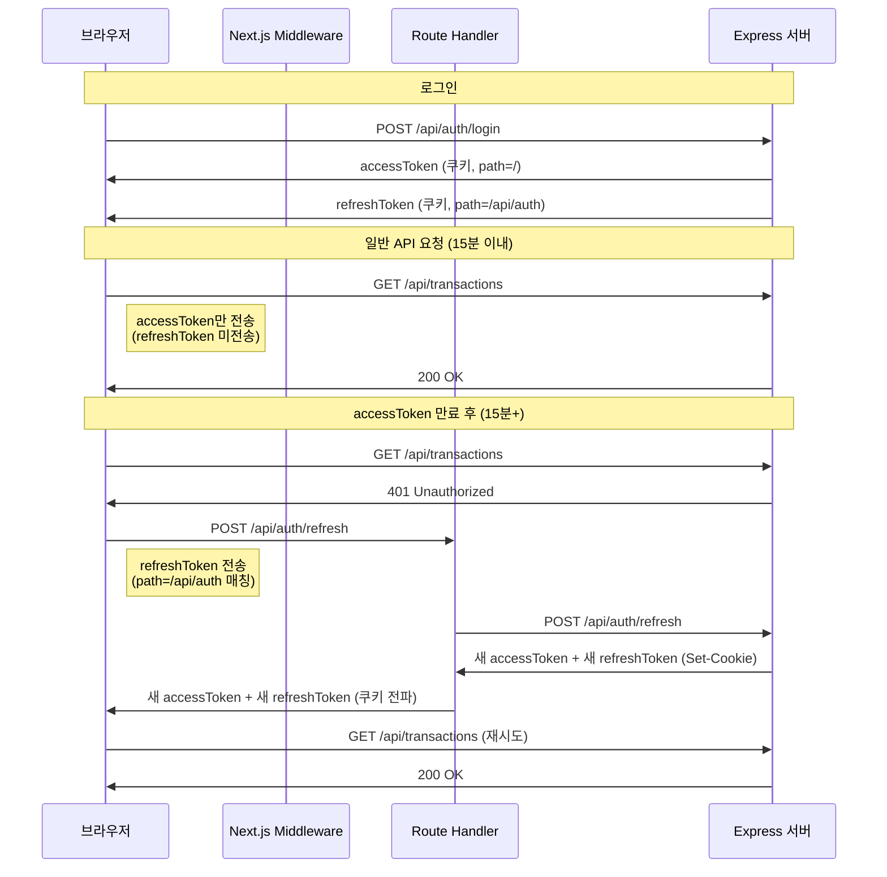

# 인증 토큰 보안 개선

## 1. 문제점 분석

### 1.1 토큰 갱신 실패 문제

**증상**: 로그인 후 30분 정도 지나서 새로고침하면 로그인 페이지로 리다이렉트됨

**근본 원인**: RefreshToken Rotation 후 쿠키 전파 실패

```
기존 흐름:
1. 로그인 → refreshToken_A 발급
2. 15분 후 accessToken 만료 → refresh 호출
3. 서버: refreshToken_A revoke, refreshToken_B 발급 (Set-Cookie)
4. ❌ 브라우저 쿠키에는 여전히 refreshToken_A 저장 (전파 실패)
5. 다시 15분 후 새로고침
6. middleware가 refreshToken_A로 갱신 시도
7. 서버: "REVOKED" → 모든 세션 무효화 → 로그인 페이지로 리다이렉트
```

**문제 코드 위치**:
- `client/middleware.ts`: Route Handler 응답의 Set-Cookie를 브라우저로 전달하지 않음
- `client/src/app/api/auth/refresh/route.ts`: 서버의 refreshToken Set-Cookie를 클라이언트로 전파하지 않음

---

## 2. 해결 방안

### 2.1 선택된 접근법: RefreshToken Rotation 쿠키 전파

**구조**:
```
AccessToken:  httpOnly=false, path=/         → 클라이언트 인증 상태 확인 가능
RefreshToken: httpOnly=true, path=/api/auth  → 갱신 요청에만 전송
```

**핵심 수정**:
- middleware.ts와 route.ts에서 서버 응답의 refreshToken Set-Cookie를 클라이언트로 전파

### 2.2 토큰 역할

| 토큰 | 만료 시간 | 용도 |
|------|----------|------|
| AccessToken | 15분 | 일반 API 인증, 클라이언트 인증 상태 확인 |
| RefreshToken | 7일 | AccessToken 갱신 요청 시에만 사용 |

---

## 3. 구현 상세

### 3.1 서버 수정

#### auth.ts - 쿠키에서 토큰 읽기 지원
**파일**: `server/src/middlewares/auth.ts`

```typescript
// Authorization 헤더 우선, 없으면 쿠키에서 읽기
const authHeader = req.headers['authorization'];
let token = authHeader && authHeader.split(' ')[1];

if (!token) {
  token = req.cookies?.accessToken;
}
```

#### authController.ts - refreshToken path 제한
**파일**: `server/src/controllers/authController.ts`

```typescript
const refreshTokenCookieOptions: CookieOptions = {
  httpOnly: true,
  secure: isProduction,
  sameSite: isProduction ? 'none' : 'lax',
  maxAge: refreshTokenMaxAgeMs,
  domain: process.env.COOKIE_DOMAIN || undefined,
  path: '/api/auth',  // 갱신 엔드포인트에서만 전송
};
```

---

### 3.2 클라이언트 수정

#### constants/auth.ts - 쿠키 설정
**파일**: `client/src/lib/constants/auth.ts`

```typescript
// accessToken: JS에서 접근 가능 (인증 상태 확인용)
export const getAccessTokenCookieOptions = (maxAge = DEFAULT_ACCESS_TOKEN_MAX_AGE) => ({
  name: ACCESS_TOKEN_COOKIE_NAME,
  httpOnly: false,  // 클라이언트 인증 상태 확인 가능
  secure: process.env.NODE_ENV === "production",
  sameSite: "lax" as const,
  path: "/",
  maxAge,
  ...(ACCESS_TOKEN_COOKIE_DOMAIN ? { domain: ACCESS_TOKEN_COOKIE_DOMAIN } : {}),
});

// refreshToken: 갱신 요청에만 전송
export const getRefreshTokenCookieOptions = (maxAge = DEFAULT_REFRESH_TOKEN_MAX_AGE) => ({
  name: REFRESH_TOKEN_COOKIE_NAME,
  httpOnly: true,
  secure: process.env.NODE_ENV === "production",
  sameSite: "lax" as const,
  path: "/api/auth",  // 갱신 엔드포인트에서만 전송
  maxAge,
  ...(ACCESS_TOKEN_COOKIE_DOMAIN ? { domain: ACCESS_TOKEN_COOKIE_DOMAIN } : {}),
});
```

#### route.ts - refreshToken 전파 (핵심)
**파일**: `client/src/app/api/auth/refresh/route.ts`

```typescript
export async function POST(request: NextRequest) {
  // ... API 호출 ...

  const response = NextResponse.json({ success: true, accessToken });

  // accessToken 쿠키 설정
  response.cookies.set({
    ...getAccessTokenCookieOptions(DEFAULT_ACCESS_TOKEN_MAX_AGE),
    value: accessToken,
  });

  // 서버 응답의 Set-Cookie에서 refreshToken 추출하여 전파 (rotation 지원)
  const setCookieHeader = apiResponse.headers.get("set-cookie");
  const newRefreshToken = extractRefreshTokenFromSetCookie(setCookieHeader);

  if (newRefreshToken) {
    response.cookies.set({
      ...getRefreshTokenCookieOptions(DEFAULT_REFRESH_TOKEN_MAX_AGE),
      value: newRefreshToken,
    });
  }

  return response;
}
```

#### middleware.ts - refreshToken 전파 (핵심)
**파일**: `client/middleware.ts`

```typescript
if (refreshResponse.ok) {
  const response = NextResponse.next();

  // accessToken 쿠키 설정
  response.cookies.set({
    ...getAccessTokenCookieOptions(DEFAULT_ACCESS_TOKEN_MAX_AGE),
    value: newAccessToken,
  });

  // refreshToken 쿠키 전파 (rotation 지원)
  const setCookieHeader = refreshResponse.headers.get("set-cookie");
  const newRefreshToken = extractRefreshTokenFromSetCookie(setCookieHeader);

  if (newRefreshToken) {
    response.cookies.set({
      ...getRefreshTokenCookieOptions(DEFAULT_REFRESH_TOKEN_MAX_AGE),
      value: newRefreshToken,
    });
  }

  return response;
}
```

---

## 4. 수정 파일 요약

| 파일 | 변경 내용 |
|------|----------|
| `server/src/middlewares/auth.ts` | 쿠키에서 accessToken 읽기 지원 (하위 호환) |
| `server/src/controllers/authController.ts` | refreshToken 쿠키 path=/api/auth |
| `client/src/lib/constants/auth.ts` | refreshToken 쿠키 옵션 추가 |
| `client/src/app/api/auth/refresh/route.ts` | refreshToken 쿠키 전파 |
| `client/middleware.ts` | refreshToken 쿠키 전파 |

---

## 5. 토큰 흐름 다이어그램

### 5.1 개선된 흐름


```mermaid
sequenceDiagram
    participant B as 브라우저
    participant M as Next.js Middleware
    participant R as Route Handler
    participant S as Express 서버

    Note over B,S: 로그인
    B->>S: POST /api/auth/login
    S->>B: accessToken (쿠키, path=/)
    S->>B: refreshToken (쿠키, path=/api/auth)

    Note over B,S: 일반 API 요청 (15분 이내)
    B->>S: GET /api/transactions
    Note right of B: accessToken만 전송<br/>(refreshToken 미전송)
    S->>B: 200 OK

    Note over B,S: accessToken 만료 후 (15분+)
    B->>S: GET /api/transactions
    S->>B: 401 Unauthorized
    B->>R: POST /api/auth/refresh
    Note right of B: refreshToken 전송<br/>(path=/api/auth 매칭)
    R->>S: POST /api/auth/refresh
    S->>R: 새 accessToken + 새 refreshToken (Set-Cookie)
    R->>B: 새 accessToken + 새 refreshToken (쿠키 전파)
    B->>S: GET /api/transactions (재시도)
    S->>B: 200 OK
```

### 5.2 쿠키 전송 범위

```
요청 URL                    accessToken    refreshToken
─────────────────────────────────────────────────────────
GET  /api/transactions      ✓ 전송         ✗ 미전송
GET  /api/notes             ✓ 전송         ✗ 미전송
POST /api/auth/refresh      ✓ 전송         ✓ 전송
POST /api/auth/login        ✓ 전송         ✓ 전송
POST /api/auth/logout       ✓ 전송         ✓ 전송
```

---

## 6. 테스트 시나리오

### 6.1 기본 기능
- [ ] 일반 로그인 → 대시보드 접근
- [ ] Google 로그인 → 대시보드 접근
- [ ] 로그아웃 → 쿠키 삭제 확인

### 6.2 토큰 갱신
- [ ] 15분 후 API 호출 → 토큰 자동 갱신 확인
- [ ] 30분+ 후 새로고침 → 로그인 유지 확인
- [ ] 여러 탭에서 동시 사용 → 토큰 충돌 없음

### 6.3 SSR
- [ ] 새로고침 → 인증 상태 유지
- [ ] 딥링크 접근 → 인증 상태 유지

---

## 7. 참고 자료

- [OWASP Session Management Cheat Sheet](https://cheatsheetseries.owasp.org/cheatsheets/Session_Management_Cheat_Sheet.html)
- [RFC 6265 - HTTP State Management Mechanism](https://tools.ietf.org/html/rfc6265)
- 기존 인증 문서: [docs/01_authentication-flow.md](./01_authentication-flow.md)
